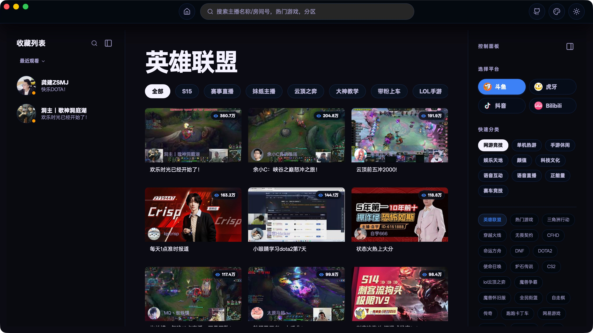
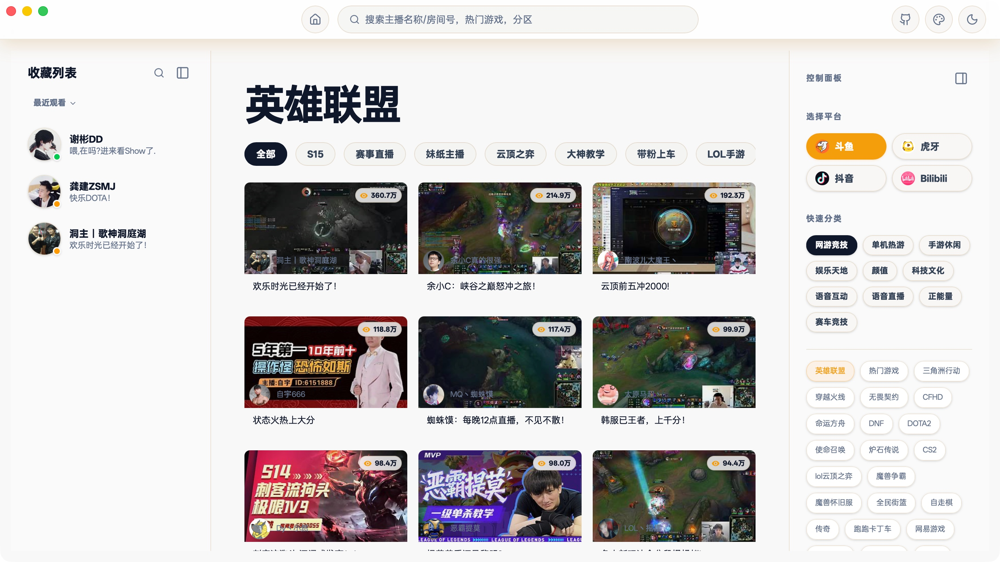
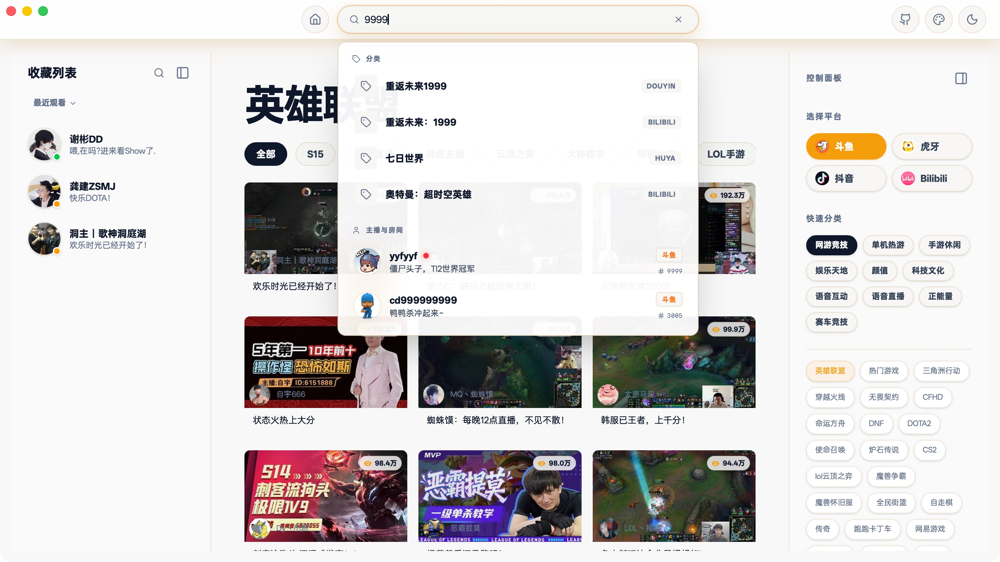
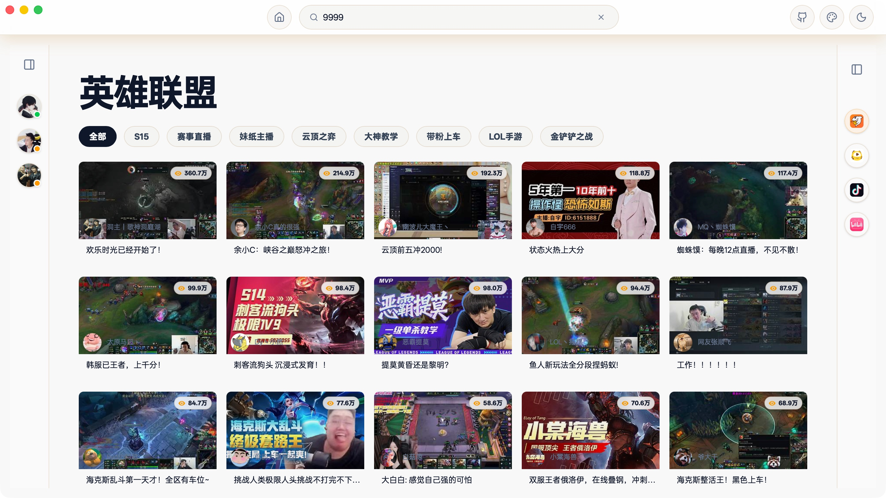
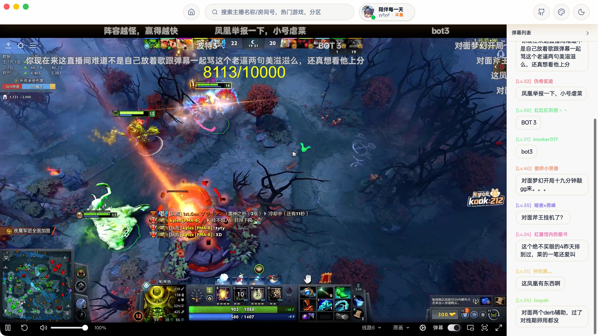
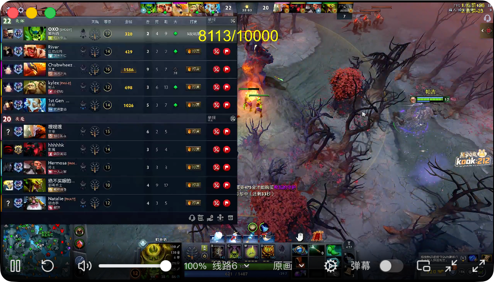

  
  <h1>DTV</h1>
  
基于 Tauri 2.0 的跨平台斗鱼、虎牙、抖音、bilibili直播桌面客户端

## 说明

1. 基于[DTV](https://github.com/chen-zeong/DTV)的ui重构

### 支持平台

| 平台     | 直播流 | 弹幕 | 搜索     |
| -------- | ------ | ---- | -------- |
| 斗鱼     | ✅     | ✅   | ✅       |
| 虎牙     | ✅     | ✅   | ✅       |
| bilibili | ✅     | ✅   | ✅       |
| 抖音     | ✅     | ✅   | 仅房间号 |

## 功能

- 📺 平台支持：支持斗鱼、虎牙、bilibili、抖音直播
- 💬 弹幕显示：实时显示直播间弹幕，只显示聊天弹幕，不显示礼物等其他类型弹幕
- ⭐ 主播收藏：支持收藏喜欢的主播，支持收藏列表手动拖拽排序
- 📋 支持平台：Mac(Intel+Arm)，Windows(Win7需要自行安装Webview2)，Linux(包括Ubuntu和各类发行版)
- 🌓 主题切换：支持明暗主题切换

## 修改

1. ui界面重构，着重优化了分区列表，左右边栏可以折叠，灵感来源spotify
2. 优化了搜索栏，现在可以搜索任意平台的内容， 包括主播名称，房间号，分区名
3. 添加了主题色切换按钮
4. 在直播界面添加了状态胶囊，占用屏幕空间更小
5. 弹幕列表可以折叠了
6. css使用tailwind重构，后续考虑切换到react
7. 本人只有mac电脑，win客户端由CI自动构建未经测试。

## 软件截图

  
  
  
  
  

 

## 安装方式

请参考原项目

## 参考

- 斗鱼直播流获取参考了 [@wbt5/real-url](https://github.com/wbt5/real-url) (GPL-2.0)
- 抖音弹幕参考了 [@saermart/DouyinLiveWebFetcher](https://github.com/saermart/DouyinLiveWebFetcher) (AGPL-3.0)
- 虎牙参考了 [liuchuancong/pure_live](https://github.com/liuchuancong/pure_live) (AGPL-3.0) 和 [ihmily/DouyinLiveRecorder](https://github.com/ihmily/DouyinLiveRecorder) (MIT)
- b站弹幕参考了 [xfgryujk/blivedm](https://github.com/xfgryujk/blivedm) (MIT)

## 许可证

本项目遵循 [AGPL-3.0](./LICENSE) 开源协议。
